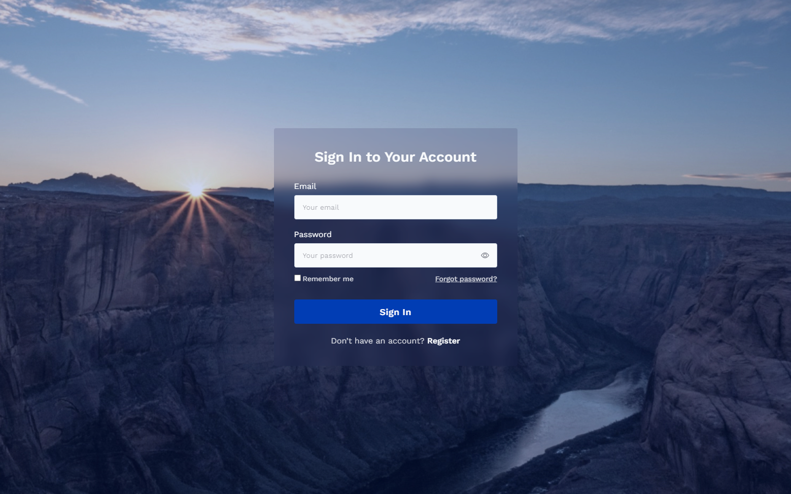

# Sign In

Olá, pessoal! Acabei de finalizar um projeto em React, no qual também desenvolvi o design da interface. 

A tela tem um layout intuitivo, com campos essenciais como e-mail e senha. Incluí um checkbox de "Remember me" e um link para "Forgot password?" para quem esquecer a senha.

O campo de senha possui um ícone que permite alternar entre mostrar 👁️ ou esconder 🙈 a senha, facilitando o preenchimento.

O botão "Sign In" fica logo abaixo dos campos, tornando o próximo passo claro e simples. E, se você não tem uma conta, tem um botão com a mensagem "Don’t have an account? Register" para se cadastrar.

A tela foi projetada para ser agradável e fácil de usar. ✨

## Tecnologias Utilizadas
- HTML
- CSS
- React

## Gostou do design?

[Veja mais aqui!](https://www.behance.net/ianaribeiro/)

## Dê play no projeto!

[Confira aqui!](https://iana-ribeiro.github.io/signin/)

## Contato

**E-mail**: ianaribeiro.tech@gmail.com

Ou entre em contato pelo [LinkedIn](https://www.linkedin.com/in/iana-ribeiro/).
